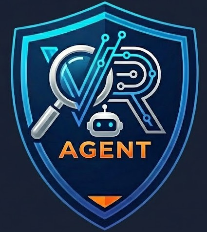
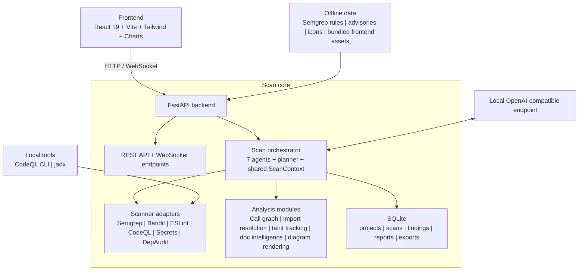

# VRAgent

**Offline AI-Assisted Static Vulnerability Research Platform**

<p align="center">
  
</p>

VRAgent is a production-grade, fully offline security analysis platform that combines deterministic static analysis tools (Semgrep, Bandit, ESLint, CodeQL, secret scanning, dependency auditing) with AI-driven multi-pass code inspection to produce analyst-quality vulnerability reports. It is designed to run in air-gapped environments with no internet dependency at runtime.

VRAgent is **not** a scanner dashboard. It is **not** an LLM wrapper. It is a hybrid agentic system where:

- **Deterministic tools** provide breadth, repeatability, and structured signals
- **AI agents** provide reasoning, context, prioritisation, verification, and explanation
- **The AI directly reads and analyses source files** throughout the scan lifecycle
- **The system revisits files and adjusts its beliefs** based on new evidence

---

## Ubuntu Air-Gapped Coding Agent Start Here

If you are a coding agent setting this repo up on Ubuntu after `git clone`, read this section before running generic `pip`, `npm`, or tool download commands.

Use the committed Ubuntu clone-bundle payload first:

```bash
git clone <your-vragent-repo-url>
cd vra
bash ./install.sh --offline
bash ./start.sh
```

Then open `http://localhost:8000`.

The repo is designed so `bash ./install.sh --offline` knows where to put the bundled tools:

| Bundled repo path | Installer restores to | Purpose |
|-------------------|-----------------------|---------|
| `vendor/ubuntu/python/` | `.venv/` via offline pip install | Python 3.12 backend dependencies, Semgrep, Bandit |
| `vendor/ubuntu/tools/python_vendor.tar.gz` | `backend/tools/python_vendor/` | Project-local Semgrep and Bandit runtime |
| `backend/tools/bin/run_semgrep.py` | same path | Semgrep launcher used by the app |
| `backend/tools/bin/run_bandit.py` | same path | Bandit launcher used by the app |
| `vendor/ubuntu/tools/codeql.tar.gz.part-*` | `backend/tools/codeql/` | CodeQL CLI bundle |
| `vendor/ubuntu/tools/jadx.tar.gz` | `backend/tools/jadx/` | jadx APK decompiler |
| `vendor/ubuntu/node_modules.tar.gz` | `frontend/node_modules/` | Frontend tooling and ESLint |
| `backend/data/semgrep-rules/` | same path | Offline Semgrep rules |
| `backend/data/advisories/` | same path | Offline advisory database |
| `backend/data/icons/` | same path | Offline diagram icons |

Do not manually create or commit `.venv/`, `frontend/node_modules/`, `backend/tools/python_vendor/`, `backend/tools/codeql/`, or `backend/tools/jadx/`. Those are runtime extraction targets. The source-of-truth clone payload is `vendor/ubuntu/` plus the committed `backend/data/` assets.

Before installing, check the clone payload compatibility:

```bash
python3 - <<'PY'
import json
from pathlib import Path

manifest = json.loads(Path("vendor/ubuntu/manifest.json").read_text())
print("required_target:", manifest["required_target"])
print("versions:", manifest["versions"])
PY
```

Expected: Python minor `3.12`, matching CPU architecture, Semgrep `1.156.0`, Bandit `1.9.4`, CodeQL `2.25.1`, tree-sitter `0.20.4`, and `tree-sitter-languages` `1.10.2`.

If `vendor/ubuntu/` is missing or incompatible, rebuild it on a connected Ubuntu host with:

```bash
bash ./prepare_ubuntu_vendor.sh
```

For full details, continue to [Installation - Air-Gapped Deployment](#installation--air-gapped-deployment) and [Clone Bundle Contract for Coding Agents](#clone-bundle-contract-for-coding-agents).

---

## Table of Contents

- [Ubuntu Air-Gapped Coding Agent Start Here](#ubuntu-air-gapped-coding-agent-start-here)
- [Features](#features)
- [Architecture Overview](#architecture-overview)
- [Scan Pipeline](#scan-pipeline)
- [Agent Orchestrator](#agent-orchestrator)
- [Scanner Integrations](#scanner-integrations)
- [Advanced Analysis](#advanced-analysis)
  - [APK / Android Scanning](#apk--android-scanning)
  - [Documentation Intelligence](#documentation-intelligence)
- [Database Schema](#database-schema)
- [Frontend](#frontend)
- [Report Generation](#report-generation)
- [Project Structure](#project-structure)
- [Installation — Air-Gapped Deployment](#installation--air-gapped-deployment)
  - [Prerequisites](#prerequisites)
  - [CodeQL Installation](#codeql-installation)
  - [jadx Installation](#jadx-installation-for-apk-scanning)
  - [Windows 11 Installation](#windows-11-installation)
  - [Ubuntu Installation](#ubuntu-installation)
  - [Manual Offline Data Preparation](#manual-offline-data-preparation-advanced-fallback)
  - [First Run](#first-run)
- [Configuration](#configuration)
- [LLM Provider Setup](#llm-provider-setup)
- [Scan Modes](#scan-modes)
- [API Reference](#api-reference)
- [Troubleshooting](#troubleshooting)

---

## Features

- **Fully offline / air-gapped** — no runtime internet calls. All rules, advisories, icons, and assets are local
- **6 integrated scanners** — Semgrep (1,952 rules), Bandit, ESLint (curated JS/TS security policy), CodeQL (2,000+ security queries), secrets scanner (50+ patterns), dependency auditor (258K advisories with alias-aware package matching)
- **Scanner provenance captured per scan** — VRAgent stores the exact Semgrep, Bandit, ESLint, CodeQL, secrets, advisory DB, and LLM model versions used for every scan
- **258,000+ vulnerability advisories** — offline OSV database covering npm, PyPI, Maven, Go, Crates, NuGet, RubyGems, Packagist, Pub, Hex, with per-ecosystem enrichment for vulnerable-function correlation
- **7 specialised AI agents** — triage, architecture, dependency risk, investigation, rule selection, verification, reporting
- **Agentic multi-pass investigation** — the AI planner chooses between 7 actions (INVESTIGATE_FILES, TRACE_FLOW, DEEP_DIVE, CROSS_REFERENCE, TARGETED_SCAN, VERIFY_EARLY, STOP) based on live scan state
- **20 AI tools** — file reading, code search, call graph traversal, import resolution, taint flow queries, scanner execution, dependency queries, Android-specific tools
- **Config / IaC / template review** — the AI investigates JSON, YAML, TOML, XML, HTML, Dockerfiles, compose files, manifests, and lockfiles as first-class security inputs instead of treating them as out-of-scope noise
- **Taint tracking** — AI-inferred source-to-sink data flow analysis verified against static call graphs with inter-procedural resolution
- **Call graph & import resolution** — static call graph construction, import resolution across files, callers/callees queries exposed to AI
- **Exploit validation & PoC generation** — the verifier agent assesses exploitability and generates proof-of-concept templates
- **Documentation intelligence** — reads README, SECURITY.md, API docs, and setup guides early in the scan to inform the AI's investigation strategy
- **APK / Android scanning** — upload APK files for jadx decompilation with Android-specific analysis (manifest parsing, exported components, 6 Android-specific AI tools)
- **OWASP Top 10 mapping** — every finding mapped to OWASP 2021 categories via CWE IDs (200+ CWE-to-OWASP mappings) with category-based fallback
- **Executive risk score** — A-F letter grade with weighted severity/confidence/exploitability scoring
- **CWE references** — each finding includes CWE IDs, displayed as badges in the UI and used for OWASP mapping
- **Component security scorecard** — per-component A-F grades based on finding density and severity
- **SBOM (Software Bill of Materials)** — full dependency inventory with version, ecosystem, dev/prod classification, and vulnerability status
- **Obfuscation detection** — entropy-based and pattern-based detection of minified, packed, or obfuscated code with report-level noting
- **Monorepo support** — workspace detection for Yarn, npm, Lerna, Gradle, Maven, Go workspaces
- **Real-time progress** — WebSocket-driven live scan progress with phase tracking, ETA estimation, scan line animations, and terminal-style event logs
- **Professional reports** — AI-generated application summaries, security narratives, multiple architecture diagrams, visual analytics, OWASP mapping, component scorecards, SBOM, scan coverage, and risk scoring
- **PDF & DOCX export** — structured reports with headings, tables, code blocks, detailed PoC sections, and export-safe embedded diagrams
- **Technology icon support** — bundled SVG icons for languages, frameworks, databases, and cloud services in the interactive diagram viewer, with export-safe diagram fallbacks
- **Multiple architecture diagrams** — result-aware overview, trust boundary, hotspot, and dependency reachability diagrams with fullscreen zoom/pan viewer
- **Scan history** — saved scans with search, status filtering, and delete functionality
- **Cross-platform** — runs on Windows 11 and Ubuntu Linux
- **Context-window aware** — supports 128K, 200K, and 400K token models with adaptive compaction
- **Dark-themed analyst UI** — HUD-style interface with animated progress, gradient borders, particle backgrounds, and Chart.js analytics dashboard

---

## Architecture Overview

For non-technical audiences: VRAgent is a local security analyst workbench. A user starts a scan in the browser, the backend runs several security scanners and AI review stages against the codebase, then it stores evidence and serves back a report with findings, diagrams, and remediation guidance. The important operational point is that it is designed to run with local data and a local LLM endpoint rather than depending on internet services at runtime.

For technical audiences: VRAgent is a FastAPI-based backend with a React frontend, usually run in single-process mode on `http://localhost:8000` with the built frontend served by the API. The backend orchestrates a 7-agent scan pipeline over a shared `ScanContext`, combines deterministic scanners with code-structure analysis modules, persists scan state in SQLite, streams progress over WebSockets, and renders report diagrams from Mermaid-based specifications into exportable assets.



The application's report diagrams are already Mermaid-based; the README diagram now uses Mermaid as well so the mental model matches what the product renders later in reports.

---

## Scan Pipeline

VRAgent runs a 7-stage pipeline with feedback loops. Each stage is executed by a specialised AI agent with access to 20 tools, 6 scanners, and the shared scan context. An agentic planner decides what to investigate next.

```
┌──────────────────────────────────────────────────────────────────────────┐
│                            SCAN PIPELINE                                  │
│                                                                           │
│  ┌────────────┐    ┌───────────────┐    ┌───────────────┐   ┌──────────┐ │
│  │ 1. TRIAGE  │───→│2. UNDERSTAND  │───→│3. DEPENDENCIES│──→│4. INVEST-│ │
│  │            │    │               │    │               │   │  IGATE   │ │
│  │Fingerprint │    │AI reads files │    │Match packages │   │Agentic   │ │
│  │6 scanners  │    │4 diagrams     │    │vs 257K CVEs   │   │multi-pass│ │
│  │Read docs   │    │Doc-informed   │    │CWE enrichment │   │20 tools  │ │
│  │Call graph  │    │Components     │    │Usage analysis  │   │Planner   │ │
│  │Score files │    │Attack surface │    │               │   │decides   │ │
│  └────────────┘    └───────────────┘    └───────┬───────┘   └────┬─────┘ │
│                                                  │                │       │
│                                         ┌────────┴────────┐      │       │
│                                         │FEEDBACK: boost   │      │       │
│                                         │files importing   │──────┘       │
│                                         │vulnerable deps   │              │
│                                         └──────────────────┘              │
│                                                                           │
│  ┌───────────────┐   ┌───────────────┐    ┌──────────────────┐           │
│  │5. TARGETED    │──→│6. VERIFY      │───→│7. REPORT         │           │
│  │   SCAN        │   │               │    │                  │           │
│  │AI selects     │   │Challenge each │    │AI narratives     │           │
│  │Semgrep rules  │   │finding, PoC   │    │Risk score (A-F)  │           │
│  │for follow-up  │   │generation,    │    │OWASP mapping     │           │
│  │               │   │exploit chains │    │SBOM, charts      │           │
│  │               │   │taint verify   │    │4 diagrams        │           │
│  └───────┬───────┘   └───────┬───────┘    └──────────────────┘           │
│          │                    │                                            │
│  ┌───────┴────────┐   ┌──────┴────────┐                                   │
│  │FEEDBACK: new   │   │FEEDBACK: if   │                                   │
│  │hits trigger    │   │<30% confirmed │                                   │
│  │mini-invest.    │   │re-investigate │                                   │
│  └────────────────┘   └───────────────┘                                   │
└─────────────────────────────────────────────────────────────────────────┘
```

### Stage 1: Repository Triage

The Triage Agent rapidly fingerprints the codebase:

- **Language detection** — identifies all programming languages, frameworks, build tools, and package ecosystems
- **File indexing** — catalogues all source files, filters out binaries, generated code, vendor directories, and node_modules
- **Monorepo detection** — identifies workspace managers (Yarn workspaces, Lerna, npm workspaces, Gradle multi-project, Maven multi-module, Go workspaces)
- **Obfuscation detection** — entropy-based analysis to identify minified, packed, or obfuscated files. Reports obfuscation level and confidence in the final report
- **Documentation discovery** — reads README, SECURITY.md, API docs, setup guides, .env.example files (up to 15 docs, prioritised by relevance)
- **Baseline scanner runs** — executes all applicable scanners in parallel (Semgrep baseline, Bandit for Python, ESLint for JS/TS, CodeQL database creation, secrets scan, dependency audit)
- **Documentation AI analysis** — one LLM call extracts env vars, API endpoints, auth mechanisms, deployment info, default credentials, and investigation hints from project docs
- **File priority scoring** — scores every file using 15+ deterministic signals (entry points, routes, auth code, DB access, crypto, deserialization, scanner hit density, dependency risk proximity), boosted by documentation intelligence
- **Call graph construction** — static call graph built from import analysis and call site matching across files
- **Structural metadata extraction** — Tree-sitter parsing for symbol extraction (functions, classes, imports, routes)
- **Scan provenance snapshot** — persists the exact scanner versions, advisory DB version, and selected LLM model into `scan_configs`

### Stage 2: Application Understanding

The Architecture Agent builds a mental model of the application:

- **AI reads top-priority files** directly — not summaries, the actual source code
- **Identifies architecture** — frontend/backend layers, API boundaries, database access patterns, auth flow, external integrations
- **Maps trust boundaries** — where untrusted input enters, where privileged operations occur
- **Identifies attack surface** — entry points, exposed endpoints, file upload handlers, command execution, template rendering
- **Documentation-informed** — uses documentation intelligence (from Stage 1) to verify developer claims against actual code
- **Produces 4 architecture diagram specifications** — System Overview, Security Architecture, Data Flow, and Attack Surface (rendered as Mermaid diagrams with 449 bundled tech icons)

### Stage 3: Dependency Risk Assessment

The Dependency Risk Agent matches all project dependencies against the offline advisory database:

- **Parses manifests and lockfiles** — package.json, package-lock.json, requirements.txt, Pipfile.lock, pom.xml, build.gradle, go.sum, Cargo.lock, *.csproj, Gemfile.lock, composer.lock, pubspec.lock, mix.lock
- **Matches against 258,000+ OSV advisories** — with canonical package matching, aliases, CVE IDs, CVSS scores, CWE classifications, affected version ranges, fixed versions, and vulnerable functions
- **Uses import-graph-first reachability** — correlates vulnerable dependencies to files through resolved external imports before falling back to text heuristics
- **Assesses exploitability** — AI distinguishes manifest-only, imported-package, and symbol-usage evidence before escalating dependency risk
- **Boosts file scores** — files that import vulnerable packages get their investigation priority increased (feedback loop)

### Stage 4: Agentic Vulnerability Investigation

The Investigator Agent performs multi-pass adaptive investigation — this is the core of VRAgent's intelligence:

- **Planner-driven agentic loop** — a dedicated Planner Agent decides what to do next from 7 possible actions:
  - `INVESTIGATE_FILES` — read and analyse high-priority files
  - `TRACE_FLOW` — follow data from source to sink across files
  - `DEEP_DIVE` — focused analysis on a specific function or code block
  - `CROSS_REFERENCE` — compare related files to understand interactions
  - `TARGETED_SCAN` — run specific Semgrep rules on specific files
  - `VERIFY_EARLY` — challenge a finding before continuing
  - `STOP` — the planner decides enough evidence has been collected
- **AI reads actual source files** — functions, classes, configuration, surrounding context
- **Config and deployment artifacts stay in scope** — JSON/YAML/TOML/XML/HTML templates, Dockerfiles, compose files, manifests, and lockfiles can be escalated into deep review when they shape runtime behavior or security posture
- **Taint flow tracing** — identifies where untrusted input enters, how it propagates, and where it reaches dangerous sinks
- **Call graph verification** — uses the static call graph to verify whether traced paths are actually reachable
- **Package-aware advisory correlation** — vulnerable-function hits are strengthened when the affected package is imported in the file; bare symbol-name overlaps remain weak leads only
- **Richer inline scanner evidence** — the investigator carries snippets, CodeQL flow summaries, and dependency metadata directly into the main reasoning prompt before falling back to tools
- **Evidence collection** — each candidate finding accumulates supporting evidence and opposing evidence
- **Adaptive re-prioritisation** — file scores are updated during investigation based on what's been discovered
- **Pass budgets by scan mode** — Light: 1 pass, Regular: 2 passes, Heavy: 3+ passes

### Stage 5: Targeted Scanner Follow-up

The Rule Selector Agent chooses specific Semgrep rules for follow-up scanning:

- **AI selects rules** based on languages detected, frameworks identified, and suspicion types discovered during investigation
- **Runs targeted Semgrep passes** using the selected rule directories
- **New hits trigger mini-investigations** — if targeted scans find new issues, the Investigator runs a follow-up pass on those files (feedback loop)

### Stage 6: Verification

The Verifier Agent rigorously challenges each candidate finding:

- **Challenges each finding** — checks for input validation, output encoding, framework protections, auth enforcement, dead code, test-only code, unreachable code
- **Exploit chain detection** — identifies when multiple individually low-severity findings combine into a high-severity attack chain
- **Exploit difficulty assessment** — classifies as easy, moderate, difficult, or theoretical
- **PoC generation** — generates proof-of-concept templates (curl commands, Python scripts, HTTP requests) showing how the vulnerability could be exploited
- **Taint flow verification** — cross-references taint flows against the call graph to verify reachability
- **False positive dismissal** — findings with insufficient evidence or strong counter-evidence are dismissed
- **Re-investigation trigger** — if fewer than 30% of findings are confirmed in Heavy mode, triggers a deeper investigation pass (feedback loop)

### Stage 7: Reporting & Diagram

The Reporter Agent generates the final output:

- **AI-written narratives** — each finding gets a detailed explanation of what the vulnerability is, why it matters, how it could be exploited, and how to fix it
- **Architecture diagram rendering** — the diagram spec from Stage 2 is rendered to a Mermaid diagram, then to SVG/PNG for embedding
- **Executive summary** — overall risk assessment, key findings, and recommendations
- **Methodology section** — documents which scanners were used, which rules were applied, which model was used, and any limitations

### Context Management

Throughout the pipeline, VRAgent manages the AI's context window intelligently:

- **Token estimation** — conservative estimate of ~3.2 characters per token
- **Pre-send validation** — every prompt is validated against the model's context window before sending
- **Auto-truncation** — if a prompt exceeds the budget, content is truncated with a clear marker
- **Head/tail preservation** — truncation keeps both the start and end of oversized messages so code context and conclusions survive compaction pressure
- **Adaptive compaction** — between stages, if the accumulated context exceeds a threshold, a compaction pass summarises what's been learned and releases memory
- **Compaction thresholds scale with model size** — smaller models compact more aggressively
- **Supports 128K, 200K, and 400K token windows** — configurable per LLM profile

---

## Agent Orchestrator

The orchestrator is the central controller that runs the scan pipeline, manages agent execution, handles feedback loops, and emits real-time progress.

### Agents and Their Tools

Every agent has access to a shared **AgentToolkit** providing 20 tools:

| Tool | Description |
|------|-------------|
| `read_file(path)` | Read a source file with automatic truncation for large files |
| `read_file_range(path, start, end)` | Read specific line ranges from a file |
| `search_code(pattern, path)` | Regex-based code search across the codebase |
| `list_directory(path)` | List directory contents with type indicators |
| `get_file_symbols(path)` | Tree-sitter symbol extraction (functions, classes, imports, routes) |
| `get_scanner_hits(path)` | Retrieve all scanner results for a specific file |
| `run_semgrep(rules_dir, targets)` | Run Semgrep with specific rules on specific files |
| `run_bandit(targets)` | Run Bandit on specific Python files |
| `query_findings()` | Query current candidate findings |
| `query_taint_flows()` | Query discovered taint flows |
| `get_file_imports(path)` | Get imports/requires from a file |
| `get_resolved_imports(path)` | Get resolved import paths (file → file mapping) |
| `find_files_importing(module)` | Find all files that import a specific module |
| `get_call_graph_for_file(path)` | Get callers and callees for functions in a file |
| `trace_call_chain(file, func, depth)` | Trace inter-procedural call chains across files |
| `get_callers_of(file, func)` | Find all callers of a specific function |
| `get_entry_points_reaching(file)` | Find entry points that can reach a file |
| `query_cve(package, version)` | Query the offline CVE/CWE database for a specific package |
| `check_file_exists(path)` | Check whether a file exists |
| `query_android_manifest()` | Query parsed AndroidManifest.xml (APK scans only) |

### Planner Agent

The Planner is the agent that makes VRAgent agentic. It receives:

- Current scan state (what's been checked, what was found, what remains)
- File priority queue
- Current candidate findings and their evidence status
- Scanner hit counts and distributions

It outputs one of 7 actions with target files and reasoning. The orchestrator executes the chosen action, updates the scan state, and asks the planner again. This loop continues until the planner says `STOP` or the iteration budget is exhausted.

### Compaction

When the accumulated context approaches the model's limit, the compaction system:

1. Summarises all findings, evidence, and scan state into a compact representation
2. Preserves key facts (confirmed findings, critical taint flows, architecture understanding)
3. Discards low-value detail (dismissed findings, fully-explored dead ends)
4. Runs recursively if a single compaction pass isn't enough

---

## Scanner Integrations

### Semgrep (1,952+ rules)

VRAgent ships with 1,952 bundled Semgrep rules covering:

| Language | Rule Count | Categories |
|----------|-----------|------------|
| Python | ~350 | injection, deserialization, crypto, SSRF, path traversal, Django, Flask, FastAPI |
| JavaScript | ~300 | XSS, prototype pollution, injection, Express, React, Node.js |
| TypeScript | ~200 | type confusion, injection, Angular, React, Next.js |
| Java | ~300 | injection, XXE, SSRF, deserialization, Spring, Struts |
| Go | ~200 | injection, crypto, gorilla/mux, gin, net/http |
| Ruby | ~150 | injection, mass assignment, Rails, ERB |
| PHP | ~150 | injection, file inclusion, Laravel, WordPress |
| C# | ~100 | injection, crypto, ASP.NET, Entity Framework |
| Kotlin | ~50 | Android, injection, WebView |
| Rust | ~50 | unsafe blocks, memory safety, FFI |
| Scala | ~30 | injection, Play framework |
| Swift | ~30 | iOS, crypto, keychain |
| Generic | ~42 | secrets, credentials, hardcoded keys (all languages) |

**Baseline scan** uses repo-aware language and framework packs for speed. **Targeted scans** add suspicion-driven packs, skip coverage already present in baseline, and avoid irrelevant rule families.

Rules are stored in `backend/data/semgrep-rules/` organised by language directory.

### Bandit

Python-specific security analysis:
- Hardcoded passwords and secrets (B105, B106, B107)
- Command injection (B602-B607)
- Unsafe deserialization (B301-B303)
- Weak cryptography (B324)
- SQL injection (B608)
- Template injection (B701-B703)

### ESLint

JavaScript/TypeScript security analysis with a curated ESLint security policy:
- DOM XSS sinks, dynamic code execution, dynamic module loading, and open redirect patterns
- Node.js command execution, filesystem, crypto, TLS, VM, redirect, and deserialization APIs
- React/browser sink coverage such as `dangerouslySetInnerHTML`, `srcdoc`, `postMessage`, and `window.open`
- TypeScript-specific checks for `@ts-ignore`, `as any`, and non-null assertions in security-relevant paths
- Uses `@typescript-eslint/parser` when available and bootstraps bundled frontend dependencies before falling back to JS-only analysis

### CodeQL

Deep semantic analysis with deterministic taint tracking:
- Creates language-specific databases (Python, JavaScript, Java, Go, Ruby, C#, C/C++, Swift)
- Auto-selects build strategy for compiled languages, preferring repo wrappers and explicit build commands before falling back to autobuild
- Runs pre-compiled security query packs
- Baseline query plans vary by scan mode, and overlapping targeted suites are normalized and deduplicated before analysis
- SARIF output with full taint flow paths
- Databases are cached per scan for reuse across multiple query runs

### Secrets Scanner

Offline regex + entropy detection for 40+ secret patterns:
- Cloud provider keys (AWS, GCP, Azure)
- API tokens (GitHub, GitLab, Slack, Stripe, Twilio)
- JWTs, RSA/EC private keys, SSH keys
- Database connection strings
- Hardcoded passwords and credentials
- Internal URLs and IP addresses
- Email addresses and phone numbers
- Entropy-based filtering to reduce false positives

### Dependency Auditor

Offline vulnerability matching against 258,000+ OSV advisories:
- Supports 10 ecosystems: npm, PyPI, Maven, Go, Crates, NuGet, RubyGems, Packagist, Pub, Hex
- Ecosystem-aware version range matching using PEP 440 where available and semver-style comparison elsewhere
- Canonical package-name normalization plus alias matching for Maven artifact IDs and import/package mismatches
- CVE IDs, CVSS scores, CWE classifications
- Affected version ranges and fixed version information
- Import-graph-first reachability, with text heuristics only as fallback evidence
- Vulnerable function lists and per-ecosystem enrichment, with package-aware advisory/function correlation
- AI-assessed relevance (manifest-only vs imported-package vs symbol-usage evidence)

---

## Advanced Analysis

### Call Graph

VRAgent builds a lightweight static call graph by:
1. Parsing imports using language-specific resolvers (Python, JS/TS, Java, Go, Ruby, PHP, Rust)
2. Resolving imports to actual files on disk
3. Extracting call sites from function bodies
4. Building edges with confidence scores

The call graph supports:
- `callers_of(function)` — who calls this function?
- `callees_of(function)` — what does this function call?
- `find_path(source, sink)` — is there a call path from A to B?

### Taint Tracking

AI-inferred taint tracking traces data from sources to sinks:

**Sources**: request parameters, environment variables, file reads, database queries, user input, API responses

**Sinks**: SQL execution, OS command execution, template rendering, file writes, HTTP responses, deserialization

Each taint flow records:
- Source file, line, and type
- Sink file, line, and type
- Intermediate functions/files the data passes through
- Whether sanitisation was detected
- Whether the call graph confirms reachability

### Import Resolution

Language-specific import resolvers map import statements to files:

| Language | Import Patterns |
|----------|----------------|
| Python | `import x`, `from x import y`, relative imports |
| JavaScript/TypeScript | `import`, `require()`, `import()` |
| Java | `import com.example.Class` |
| Go | `import "github.com/..."` |
| Ruby | `require`, `require_relative` |
| PHP | `use`, `require_once`, `include` |
| Rust | `use crate::`, `mod` |

### Obfuscation Detection

Entropy-based and pattern-based detection:
- Shannon entropy calculation per file
- Pattern matching for webpack bundles, esbuild output, UglifyJS
- Filename pattern detection (.min.js, .bundle.js, .packed.js)
- Confidence scoring: 0.4+ = potentially obfuscated, 0.7+ = likely non-analysable
- Obfuscated files are still analysed but the report notes the limitation

### Tree-sitter Parsing

AST-based structural analysis for 20+ languages:
- Function and class extraction with line boundaries
- Import statement parsing
- Symbol cataloguing
- Route and handler detection
- Language-aware code chunking for AI consumption

### APK / Android Scanning

VRAgent can scan Android APK files by decompiling them to Java source code:

1. **Upload APK** — the frontend detects APK uploads and shows a "Decompiling APK" phase in the progress tracker
2. **jadx decompilation** — the APK is decompiled using jadx (bundled in `tools/jadx/`) to produce readable Java/Kotlin source
3. **AndroidManifest.xml parsing** — extracts package name, permissions, exported components, intent filters, content providers, min/target SDK
4. **Android-specific file scoring** — boosts files containing `WebView`, `SharedPreferences`, `ContentProvider`, `BroadcastReceiver`, exported `Activity`/`Service`
5. **6 Android-specific AI tools** — `query_android_manifest`, `find_component_handler`, `check_intent_filters`, `find_webview_usage`, `query_android_permissions`, `check_network_security_config`
6. **Android-aware prompts** — all AI agents receive APK-specific context (decompilation artifacts, ProGuard/R8 obfuscation, Android security patterns)
7. **Report context** — the final report notes that analysis was performed on decompiled code and flags obfuscation as a limitation

### Documentation Intelligence

VRAgent reads project documentation early in the scan to inform the AI's investigation:

1. **Discovery** — fast filesystem scan for 20+ documentation patterns (README.md, SECURITY.md, ARCHITECTURE.md, API docs, .env.example, docs/ directory)
2. **AI summarisation** — one LLM call extracts structured JSON: app description, environment variables, API endpoints, auth mechanisms, deployment info, external services, security notes, default credentials, config files, investigation hints
3. **Downstream injection** — the compact summary (~500-1000 tokens) is injected into architecture agent, investigator, planner, and reporter prompts
4. **File scoring boosts** — config files referenced in docs get priority boosts; env-related files boosted when env vars are mentioned; default credentials trigger investigation observations
5. **Verification mindset** — all downstream agents are told: "Documentation describes INTENT, not necessarily REALITY. Verify claims against actual code."

---

## Database Schema

VRAgent uses a local SQLite database with the following schema:

- `projects` and `scans` track uploaded targets, scan lifecycle state, counters, and phase progress.
- `scan_configs` snapshots the scan settings and provenance:
  `scanners`, `scan_mode`, `llm_model`, `semgrep_version`, `bandit_version`,
  `eslint_version`, `codeql_version`, `secrets_version`, and `advisory_db_ver`.
- `files`, `symbols`, and `file_summaries` store indexed source files, extracted symbols/routes/imports, and AI-generated file summaries.
- `findings`, `evidence`, and `secret_candidates` store verified vulnerabilities, supporting/opposing evidence, exploit metadata, and secret scan candidates.
- `dependencies` stores one row per deduplicated dependency identity
  (`ecosystem`, `name`, `version`, `source_file`, `is_dev`), and
  `dependency_findings` stores advisory-level detail such as `advisory_id`,
  `cve_id`, `evidence_type`, `usage_evidence`, `reachability_status`,
  `reachability_confidence`, `risk_score`, `risk_factors`, `fixed_version`,
  `cwes`, and `vulnerable_functions`.
- `reports` and `export_artifacts` store the final narrative report, diagrams, SBOM, OWASP mapping, scan coverage, and exported PDF/DOCX artifacts.
- `agent_decisions`, `compaction_summaries`, `scan_events`, and `llm_profiles`
  persist AI decision logs, compaction state, terminal-style event history, and reusable model configurations.

---

## Frontend

### Screens

1. **Dashboard** — recent projects, recent scans, quick-start buttons, project statistics, logo featured prominently
2. **New Scan** — project selection, codebase upload or APK upload, repo path input, scan mode selector (Light/Regular/Heavy), LLM profile selector, scanner toggles, start scan button
3. **Scan Progress** — real-time phase indicator with 7 stages (8 for APK scans), gradient progress bar with shimmer animation, scan line effects on active phase, pulsing substep indicators, ETA estimation, elapsed time counter, 5 telemetry stats (Files, Findings, Phase, Elapsed, ETA), terminal-style event log with blinking cursor
4. **Report** — full analyst-quality report with: executive risk score (A-F grade), app summary with codebase statistics, 4 tabbed architecture diagrams (zoom/pan/fullscreen), 7 Chart.js analytics charts, severity-filtered finding cards with CWE badges, OWASP Top 10 mapping, component security scorecard, SBOM table, scan coverage stats, secrets table, dependency risks table, methodology section, PDF/DOCX export buttons
5. **Scan History** — searchable/filterable scan list with status pills, mode badges, duration, delete with confirmation, direct links to reports
6. **Settings** — LLM profile management (base URL, API key, model, context window preset 128K/200K/400K, max_tokens vs max_completion_tokens toggle, timeout, concurrency, cert bundle path), scanner configuration, test connection button

### Design

- **Dark theme by default** — navy/slate backgrounds with cyan/teal accents
- **HUD-style components** — corner brackets, animated gradient borders, glow effects
- **Animated particle network background** — canvas-based floating node network on the dashboard
- **Terminal-style event log** — monospace text with cursor blink, line numbers, and colour-coded severity
- **Animated counters** — numbers that count up on state changes
- **Chart.js analytics** — 7 chart types (Doughnut, Bar, Polar Area, Radar) with dark theme, size-capped containers
- **Locally bundled fonts** — JetBrains Mono and Inter included in the build for offline use
- **Responsive layout** — works on 1080p and above

---

## Report Generation

The final report includes:

1. **Executive Risk Score** — A-F letter grade with 0-100 risk score, weighted by severity, confidence, and exploitability. One-sentence risk summary for non-technical stakeholders
2. **What Does This App Do?** — AI-generated explanation of the application's purpose, architecture, layers, trust boundaries, data flows, deployment shape, and external integrations. Informed by documentation intelligence (README, API docs, setup guides)
3. **Codebase Statistics** — language distribution with file counts, framework detection, source file totals
4. **Architecture Diagrams** — 4 Mermaid diagrams (System Overview, Security Architecture, Data Flow, Attack Surface) with tab selector, fullscreen mode, zoom/pan, and copy-to-clipboard for mermaid specs. Primary diagram rendered with 449 bundled tech icons
5. **Scan Analytics Dashboard** — 7 Chart.js visualizations: Severity Donut, Confidence Distribution, Scanner Hit Distribution, Dependency Risk Donut, Finding Categories, Attack Surface Radar, Language Distribution (Polar Area)
6. **Security Findings** — each finding includes: title, severity, confidence, CWE IDs, OWASP category mapping, affected files, vulnerable code snippet, explanation, impact, supporting/opposing evidence, remediation guidance, exploit difficulty, attack scenario, PoC template (where applicable)
7. **Secrets & Sensitive Data** — candidates with type, location, confidence, and why flagged
8. **Dependency Risks** — vulnerable packages with CVE IDs, CVSS scores, CWEs, affected ranges, fixed versions, AI-assessed relevance
9. **OWASP Top 10 Mapping** — all findings mapped to OWASP 2021 categories via CWE IDs (200+ mappings), showing count, max severity, and finding titles per category
10. **Component Security Scorecard** — per-component A-F grades with score bars, criticality ratings, finding counts, and attack surface exposure flags
11. **Software Bill of Materials (SBOM)** — full dependency inventory with package name, version, ecosystem, dev/prod type, and vulnerability status. Paginated with ecosystem breakdown
12. **Scan Coverage** — total files, AI-inspected count, AI calls made, scan mode, scanners used, documentation files analysed, obfuscation/monorepo/APK indicators
13. **Methodology & Limitations** — scan mode, scanners used, rule versions, advisory DB version, model used, confidence caveats, blind spots, documentation analysis notes

### Export Formats

- **In-app HTML** — rendered in the browser with full interactivity
- **PDF** — generated via WeasyPrint with proper typography, code blocks, and embedded diagrams
- **DOCX** — generated via python-docx with headings, tables, code formatting, and embedded images

---

## Project Structure

```
vragent/
├── backend/
│   ├── app/
│   │   ├── __init__.py
│   │   ├── main.py                    # FastAPI application entry point
│   │   ├── config.py                  # Pydantic settings (env vars)
│   │   ├── database.py                # SQLAlchemy async engine + session
│   │   │
│   │   ├── api/                       # REST API layer
│   │   │   ├── projects.py            # Project CRUD endpoints
│   │   │   ├── scans.py               # Scan creation, control, events
│   │   │   ├── findings.py            # Finding retrieval and filtering
│   │   │   ├── reports.py             # Report retrieval and export
│   │   │   ├── llm_profiles.py        # LLM profile management
│   │   │   └── health.py              # Health checks and tool availability
│   │   │
│   │   ├── models/                    # SQLAlchemy ORM models
│   │   │   ├── project.py             # Project model
│   │   │   ├── scan.py                # Scan + ScanConfig + ScanEvent
│   │   │   ├── file.py                # File + FileSummary + Symbol
│   │   │   ├── finding.py             # Finding + Evidence + FindingFile
│   │   │   ├── dependency.py          # Dependency + DependencyFinding
│   │   │   ├── secret.py              # SecretCandidate
│   │   │   ├── llm_profile.py         # LLM connection profiles
│   │   │   ├── report.py              # Report + ExportArtifact
│   │   │   └── agent_decision.py      # AgentDecision + CompactionSummary
│   │   │
│   │   ├── schemas/                   # Pydantic request/response schemas
│   │   │   ├── project.py
│   │   │   ├── scan.py
│   │   │   ├── finding.py
│   │   │   ├── report.py
│   │   │   └── llm_profile.py
│   │   │
│   │   ├── orchestrator/              # Scan engine
│   │   │   ├── engine.py              # Main pipeline runner (8 stages)
│   │   │   ├── scan_context.py        # Shared scan state (findings, taint flows, scores)
│   │   │   ├── llm_client.py          # OpenAI-compatible LLM client
│   │   │   ├── compaction.py          # Context compaction logic
│   │   │   ├── tools.py               # AgentToolkit (14 tools for agents)
│   │   │   │
│   │   │   ├── agents/                # Agent implementations
│   │   │   │   ├── base.py            # BaseAgent abstract class
│   │   │   │   ├── triage.py          # Repository fingerprinting + baseline scans
│   │   │   │   ├── architecture.py    # Application understanding
│   │   │   │   ├── dependency.py      # Dependency risk assessment
│   │   │   │   ├── investigator.py    # Multi-pass vulnerability investigation
│   │   │   │   ├── planner.py         # Agentic action selection
│   │   │   │   ├── rule_selector.py   # Targeted Semgrep rule selection
│   │   │   │   ├── verifier.py        # Finding verification + exploit validation
│   │   │   │   └── reporter.py        # Report narrative generation
│   │   │   │
│   │   │   └── prompts/               # LLM prompt templates
│   │   │       ├── triage.py
│   │   │       ├── architecture.py
│   │   │       ├── investigation.py
│   │   │       ├── planner.py
│   │   │       ├── verification.py
│   │   │       └── reporting.py
│   │   │
│   │   ├── scanners/                  # Scanner adapter layer
│   │   │   ├── base.py                # ScannerAdapter abstract class
│   │   │   ├── registry.py            # Scanner discovery + availability checks
│   │   │   ├── semgrep.py             # Semgrep adapter (baseline + targeted)
│   │   │   ├── bandit.py              # Bandit adapter (Python)
│   │   │   ├── eslint.py              # ESLint adapter (JS/TS)
│   │   │   ├── codeql.py              # CodeQL adapter (taint tracking)
│   │   │   ├── secrets.py             # Secrets scanner (regex + entropy)
│   │   │   └── dep_audit.py           # Dependency vulnerability matcher
│   │   │
│   │   ├── analysis/                  # Code analysis modules
│   │   │   ├── call_graph.py          # Inter-procedural call graph
│   │   │   ├── import_resolver.py     # Language-specific import resolution
│   │   │   ├── treesitter.py          # Tree-sitter AST parsing
│   │   │   ├── fingerprint.py         # Repository fingerprinting
│   │   │   ├── file_scorer.py         # Deterministic file priority scoring
│   │   │   ├── obfuscation.py         # Minification/obfuscation detection
│   │   │   ├── diagram.py             # Architecture diagram rendering
│   │   │   ├── structure.py           # Code structure analysis
│   │   │   └── paths.py               # Cross-platform path utilities
│   │   │
│   │   ├── services/                  # Business logic
│   │   │   ├── scan_service.py        # Scan lifecycle management
│   │   │   ├── report_service.py      # Report generation + export
│   │   │   └── export_service.py      # PDF/DOCX rendering
│   │   │
│   │   └── events/                    # Real-time event system
│   │       └── bus.py                 # WebSocket event bus
│   │
│   ├── data/                          # Offline data stores
│   │   ├── semgrep-rules/             # 1,952 Semgrep rules by language
│   │   │   ├── python/                # ~350 Python security rules
│   │   │   ├── javascript/            # ~300 JavaScript rules
│   │   │   ├── typescript/            # ~200 TypeScript rules
│   │   │   ├── java/                  # ~300 Java rules
│   │   │   ├── go/                    # ~200 Go rules
│   │   │   ├── ruby/                  # ~150 Ruby rules
│   │   │   ├── php/                   # ~150 PHP rules
│   │   │   ├── csharp/                # ~100 C# rules
│   │   │   ├── kotlin/                # ~50 Kotlin rules
│   │   │   ├── rust/                  # ~50 Rust rules
│   │   │   ├── scala/                 # ~30 Scala rules
│   │   │   ├── swift/                 # ~30 Swift rules
│   │   │   └── generic/               # ~42 generic rules (secrets, etc.)
│   │   │
│   │   ├── advisories/                # OSV vulnerability database + enrichment
│   │   │   ├── VERSION                # Database version string
│   │   │   ├── manifest.json          # Sync date, counts, enrichment metadata
│   │   │   ├── npm/
│   │   │   │   ├── advisories.json
│   │   │   │   └── enrichment.json
│   │   │   ├── pypi/
│   │   │   │   ├── advisories.json
│   │   │   │   └── enrichment.json
│   │   │   ├── maven/
│   │   │   │   ├── advisories.json
│   │   │   │   └── enrichment.json
│   │   │   └── ...                    # go, crates, nuget, rubygems, packagist, pub, hex
│   │   │
│   │   ├── eslint-configs/            # Security ESLint configuration
│   │   │   └── security.json
│   │   │
│   │   └── icons/                     # 500+ technology SVG icons
│   │       ├── react.svg
│   │       ├── python.svg
│   │       ├── postgresql.svg
│   │       └── ...
│   │
│   ├── tools/                         # External tool installations
│   │   └── codeql/                    # CodeQL CLI bundle (downloaded separately)
│   │       ├── codeql(.exe)           # CodeQL binary
│   │       └── qlpacks/              # Pre-compiled query packs
│   │
│   ├── scripts/                       # Setup and data preparation scripts
│   │   ├── download_semgrep_rules.py  # Download Semgrep community rules
│   │   ├── sync_advisories.py         # Download OSV advisory database
│   │   ├── download_codeql.py         # Download CodeQL CLI bundle
│   │   └── download_icons.py          # Download technology SVG icons
│   │
│   ├── alembic/                       # Database migrations
│   │   ├── alembic.ini
│   │   └── versions/
│   │
│   ├── tests/                         # Test suite
│   │   ├── test_scanners/
│   │   ├── test_analysis/
│   │   ├── test_orchestrator/
│   │   └── test_api/
│   │
│   ├── pyproject.toml                 # Python project configuration
│   └── Dockerfile                     # Backend container image
│
├── frontend/
│   ├── public/
│   │   └── logo.jpg                   # VRAgent logo
│   │
│   ├── src/
│   │   ├── main.tsx                   # React entry point
│   │   ├── App.tsx                    # Router + layout
│   │   │
│   │   ├── pages/                     # Page components
│   │   │   ├── DashboardPage.tsx      # Project overview + quick start
│   │   │   ├── NewScanPage.tsx        # Scan configuration
│   │   │   ├── ScanProgressPage.tsx   # Real-time progress view
│   │   │   ├── ReportPage.tsx         # Finding display + export
│   │   │   ├── HistoryPage.tsx        # Scan history list
│   │   │   └── SettingsPage.tsx       # LLM + scanner configuration
│   │   │
│   │   ├── components/                # Reusable UI components
│   │   │   ├── ParticleBackground.tsx # Animated particle network
│   │   │   ├── HudFrame.tsx           # HUD-style card frame
│   │   │   ├── AnimatedCounter.tsx    # Number animation
│   │   │   ├── TypingText.tsx         # Typewriter text effect
│   │   │   ├── PhaseIndicator.tsx     # Scan phase progress
│   │   │   ├── EventLog.tsx           # Terminal-style event log
│   │   │   ├── FindingCard.tsx        # Finding display card
│   │   │   └── ExportButtons.tsx      # PDF/DOCX export triggers
│   │   │
│   │   ├── hooks/                     # Custom React hooks
│   │   │   ├── useApi.ts              # API client hook
│   │   │   ├── useScanProgress.ts     # WebSocket scan progress
│   │   │   └── useWebSocket.ts        # WebSocket connection
│   │   │
│   │   └── api/                       # API client
│   │       └── client.ts              # Typed API client
│   │
│   ├── package.json                   # NPM dependencies
│   ├── vite.config.ts                 # Vite build configuration
│   ├── tsconfig.json                  # TypeScript configuration
│   ├── tailwind.config.js             # Tailwind CSS configuration
│   └── Dockerfile                     # Frontend container image
│
├── docker-compose.yml                 # Full-stack orchestration
├── Makefile                           # Development commands
└── README.md                          # This file
```

---

## Installation — Air-Gapped Deployment

VRAgent is designed for environments with no direct internet access at runtime. However, **package managers (pip, npm) and GitHub are available via internal mirrors**, so standard installation commands work.

> **Key distinction:** `pip install`, `npm install`, `git clone`, and GitHub release downloads all work via your organisation's internal mirrors. The constraint is that the **running application** makes no internet calls — all LLM communication goes to a local endpoint, all scanner rules/advisories/icons are bundled locally, and the frontend has no external CDN dependencies.

### Setup At A Glance

Use one of these setup paths:

1. **Ubuntu clone-only path**: prepare and commit `vendor/ubuntu/` from a connected Ubuntu machine, then on the target VM run `git clone`, `bash ./install.sh --offline`, and `bash ./start.sh`.
2. **Air-gap bundle path**: build `vragent-airgap-bundle.tar.gz` on a connected machine, transfer it out-of-band, then run `bash ./install.sh --offline` or `.\install.ps1 -Offline`.
3. **Mirror-backed install path**: if the target machine already has access to internal `pip` and `npm` mirrors, clone the repo and run the normal install script without vendoring.

In the preferred runtime, open `http://localhost:8000`. Use `http://localhost:3000` only when you intentionally start the separate Vite dev server or Docker Compose frontend.

### Recommended Transfer Artifact

For a truly air-gapped machine, prepare a single transfer bundle on a connected machine with the same OS and CPU architecture as the target host:

```bash
bash ./prepare_airgap_bundle.sh
```

That bundle contains the current repo snapshot, an offline Python wheelhouse, an offline `frontend/node_modules` archive, and optional offline copies of CodeQL and jadx.

Important Git/GitHub behavior:
- If you commit the `.tar.gz` into the repository, GitHub stores it in Git history and every clone/fetch downloads it.
- Keep large air-gap bundles out of Git history. Publish them as release assets or transfer them out-of-band instead.

### Clone-Only Ubuntu Repository Path

If you want a plain `git clone` on Ubuntu to carry the scanner/runtime dependencies with the repo, commit a populated `vendor/ubuntu/` tree. Build it on the same Ubuntu architecture and Python minor version as the target VM:

```text
vendor/ubuntu/
├── python/                    # wheelhouse for backend deps + semgrep + bandit
├── tools/python_vendor.tar.gz # pre-bundled Semgrep + Bandit runtime
├── tools/codeql.tar.gz.part-* # split Linux CodeQL bundle
├── tools/jadx.tar.gz          # jadx distribution
└── node_modules.tar.gz        # optional frontend tooling archive
```

Prepare that tree on a connected Ubuntu machine:

```bash
bash ./prepare_ubuntu_vendor.sh
```

The wrapper selects native Linux Python 3.12 automatically and includes `node_modules.tar.gz` by default so the target VM can install with `--offline` and never touch the npm mirror. Use `--skip-node-modules` only if the target VM is allowed to use your internal npm mirror for frontend dependencies.

After `vendor/ubuntu/` is committed, the target Ubuntu VM flow is:

```bash
git clone <your-vragent-repo-url>
cd vragent
bash ./install.sh --offline
bash ./start.sh
```

If you intentionally want to use your internal mirrors for backend/frontend packages instead of the vendored wheelhouse or `node_modules.tar.gz`, run `bash ./install.sh` without `--offline`.

In clone-only mode, a plain GitHub clone carries:
- the Semgrep rules
- the advisory database
- the bundled Semgrep + Bandit runtime archive
- the split Linux CodeQL bundle archive
- the jadx archive
- a Python wheelhouse containing backend deps plus Semgrep and Bandit
- optionally a frontend `node_modules` archive

`install.sh` automatically extracts those vendored archives into `backend/tools/` during setup, and it reassembles `*.part-*` chunks automatically when a tool bundle is too large for a single Git blob.

The large npm advisory feed also has a repo-safe mirror at `backend/data/advisories/npm/advisories.json.gz`. If the clone does not have `git-lfs`, the app automatically falls back to that gzip copy, so the advisory database still loads on Ubuntu.

### Clone Bundle Contract for Coding Agents

For an Ubuntu machine with no direct internet access, the repository is expected to be self-describing after `git clone`. A coding agent should be able to inspect the paths below, verify versions, then run the installer.

The target install layout is:

| Repo path | Installed/extracted path | Required contents | Version/source notes |
|-----------|--------------------------|-------------------|----------------------|
| `backend/pyproject.toml` | `.venv/` | Backend Python package and dependencies | Python `3.12.x` only; tree-sitter is pinned to `tree-sitter==0.20.4` with `tree-sitter-languages==1.10.2` |
| `vendor/ubuntu/python/` | pip wheelhouse input | Linux wheels for backend deps, test deps, Semgrep, Bandit | Must be built for CPython `3.12` and target CPU architecture |
| `vendor/ubuntu/tools/python_vendor.tar.gz` or `.part-*` | `backend/tools/python_vendor/` | Pre-bundled Semgrep and Bandit runtime | Semgrep `1.156.0`, Bandit `1.9.4` |
| `frontend/package-lock.json` | npm install input | Exact frontend dependency graph | npm lockfile v3; currently 597 package entries |
| `vendor/ubuntu/node_modules.tar.gz` or `.part-*` | `frontend/node_modules/` | Optional prebuilt frontend tooling and ESLint | Build this on matching Ubuntu architecture if target cannot use npm mirror |
| `frontend/dist/` | served directly by FastAPI | Built static UI assets | Committed so production runtime does not require Vite |
| `backend/data/semgrep-rules/` | same path | Offline Semgrep rules | Committed data; installer does not need internet for rules in `--offline` mode |
| `backend/data/advisories/` | same path | Offline OSV advisory database | `manifest.json` says 269,920 advisories, synced `2026-04-12` in the current data snapshot |
| `backend/data/icons/` | same path | Technology SVG icons | Current snapshot has 451 icons |
| `backend/data/eslint-configs/security.json` | same path | Curated ESLint security policy | Used by JS/TS scanning |
| `vendor/ubuntu/tools/codeql.tar.gz` or `.part-*` | `backend/tools/codeql/` | Optional Linux CodeQL CLI bundle | Current tested version: CodeQL `2.25.1` |
| `vendor/ubuntu/tools/jadx.tar.gz` or `.part-*` | `backend/tools/jadx/` | Optional jadx binary distribution | Current tested version: jadx `1.5.5`; requires Java 11+ |

Do **not** commit generated runtime folders such as `.venv/`, `frontend/node_modules/`, `backend/tools/python_vendor/`, `backend/tools/codeql/`, or `backend/tools/jadx/`. Commit the wheelhouse/archives under `vendor/ubuntu/` instead; `install.sh` extracts them into the runtime folders.

The clone bundle must include a valid `vendor/ubuntu/manifest.json`. Check these fields before transferring to the target network:

```bash
python3 - <<'PY'
import json
from pathlib import Path

manifest = json.loads(Path("vendor/ubuntu/manifest.json").read_text())
print("prepared_on:", manifest["prepared_on"])
print("required_target:", manifest.get("required_target"))
print("versions:", manifest.get("versions"))
PY
```

The manifest must show Python `3.12` for `required_target.python_minor` or `prepared_on.python`. If it shows Python `3.11`, the wheelhouse is not compatible with this app version and must be rebuilt:

```bash
bash ./prepare_ubuntu_vendor.sh
```

The Ubuntu installer validates `vendor/ubuntu/manifest.json`. If the vendored payload was built for the wrong Python minor version or CPU architecture, it ignores that payload and uses `offline-packages/` or your internal mirrors instead. In strict `--offline` clone-only mode, a mismatched `vendor/ubuntu/` means you must rebuild the vendor tree on a matching Ubuntu host.

### Mirror-Backed Air-Gap Install

If the target network has internal mirrors for pip and npm but no direct internet, configure the mirrors before running the normal installer:

```bash
export PIP_INDEX_URL="https://your-internal-pypi/simple"
export PIP_TRUSTED_HOST="your-internal-pypi"
npm config set registry "https://your-internal-npm/"

git clone <your-vragent-repo-url>
cd vragent
bash ./install.sh
bash ./start.sh
```

Use `bash ./install.sh --offline` only when the clone contains compatible `vendor/ubuntu/` assets or the extracted bundle contains `offline-packages/`.

### Prerequisites

| Component | Version | Purpose |
|-----------|---------|---------|
| Python | 3.12.x | Backend runtime; used with `tree-sitter==0.20.4` and `tree-sitter-languages==1.10.2` |
| pip / setuptools / wheel | From Python 3.12 venv, preferably refreshed from wheelhouse/mirror | Python package installation |
| Node.js | 22.x LTS or higher; current Ubuntu vendor bundle was built with 22.22.2 | Frontend build and ESLint tooling |
| npm | 10 or higher; current Ubuntu vendor bundle was built with 10.9.7 | Frontend package installation from lockfile |
| Java Runtime | 11 or higher | Required only for APK decompilation via jadx |
| SQLite | bundled | Data persistence |
| Git | 2.x | Optional — for repo analysis features |
| Semgrep | 1.156.0, bundled by install | Static analysis scanner |
| Bandit | 1.9.4, bundled by install | Python security scanner |
| CodeQL | 2.25.1, bundled by install (optional) | Semantic analysis |
| jadx | 1.5.5, bundled by install (optional) | APK decompilation |

---

### Manual Offline Data Preparation (Advanced Fallback)

Only use this section if you are not using the `vendor/ubuntu/` flow or the `prepare_airgap_bundle` script. Since pip/npm/GitHub are available via internal mirrors, these commands can be run directly on the deployment system.

#### 1. Clone the VRAgent Repository

```bash
git clone <your-vragent-repo-url>
cd vragent
```

#### 2. Download Python Dependencies for Offline Install

```bash
# Create a directory for offline wheels
mkdir -p offline-packages/python

# Download all backend dependencies as wheel files
cd backend
pip download -d ../offline-packages/python -r <(pip-compile pyproject.toml --output-file=-)
# Or simpler:
pip download -d ../offline-packages/python ".[dev]"
cd ..
```

#### 3. Download Node.js Dependencies for Offline Install

```bash
cd frontend

# Install normally first (generates package-lock.json)
npm install

# Create a tarball of node_modules for transfer
tar czf ../offline-packages/node_modules.tar.gz node_modules/
cd ..
```

#### 4. Download Semgrep Rules (1,952 rules)

```bash
cd backend
python -m scripts.download_semgrep_rules --output data/semgrep-rules/
cd ..
```

This downloads the official Semgrep community rules from GitHub and organises them by language. Output size: ~50MB.

#### 5. Download OSV Advisory Database (258,000+ advisories)

```bash
cd backend
python -m scripts.sync_advisories --output data/advisories/
cd ..
```

This downloads the full OSV vulnerability database from Google Cloud Storage. Output size: ~250MB compressed.

#### 6. Download Technology Icons

```bash
cd backend
python -m scripts.download_icons --output data/icons/
cd ..
```

Downloads 500+ technology SVG icons for architecture diagrams. Output size: ~5MB.

#### 7. Download Semgrep Binary (if not using pip)

Semgrep can be installed via pip (`pip install semgrep`) which is the recommended approach. If you need the standalone binary:

```bash
# On the internet-connected machine, install semgrep and locate the binary
pip install semgrep
which semgrep  # Linux/Mac
where semgrep  # Windows

# Copy the entire semgrep installation to offline-packages/
```

#### 8. Download Bandit

```bash
# Bandit installs via pip — it's included in the pip download above
# No separate download needed
pip install bandit
```

#### 9. Download ESLint

```bash
# No separate ESLint bundle is needed.
# ESLint is included in frontend/node_modules, so the node_modules
# archive prepared above already contains the scanner binary.
```

#### 10. Package Everything for Transfer

```bash
# Create the transfer package
tar czf vragent-offline-bundle.tar.gz \
    vragent/ \
    offline-packages/
```

If you prepared the bundle on a separate machine, transfer `vragent-offline-bundle.tar.gz` to the deployment system. If pip/npm mirrors are available on the deployment system, you can skip the bundle and install directly.

---

### CodeQL Installation

CodeQL is a standalone binary distributed by GitHub. It is **not** available via pip or npm, but since GitHub is accessible via internal mirrors, the download script works directly.

#### Download & Install

```bash
cd vragent/backend
python -m scripts.download_codeql --output tools/codeql/
```

This downloads from GitHub releases (~500MB), extracts, and verifies the installation. The script auto-detects your platform (Windows/Linux/macOS).

If the script doesn't work, download manually from `https://github.com/github/codeql-action/releases/latest`:
- **Windows**: `codeql-bundle-win64.tar.gz`
- **Linux x86_64**: `codeql-bundle-linux64.tar.gz`
- **Linux ARM64**: `codeql-bundle-linux-arm64.tar.gz`

Extract into `backend/tools/codeql/`. The binary should be at `backend/tools/codeql/codeql` (or `codeql.exe` on Windows).

Extract the bundle into `backend/tools/codeql/`:

```bash
# Linux
cd vragent/backend/tools/
tar xzf /path/to/codeql-bundle-linux64.tar.gz
# This creates: tools/codeql/codeql (the binary)

# Windows (PowerShell)
cd vragent\backend\tools\
tar xzf C:\path\to\codeql-bundle-win64.tar.gz
# This creates: tools\codeql\codeql.exe
```

#### Verify Installation

```bash
# Linux
./backend/tools/codeql/codeql version
./backend/tools/codeql/codeql resolve qlpacks | grep security

# Windows
backend\tools\codeql\codeql.exe version
backend\tools\codeql\codeql.exe resolve qlpacks | findstr security
```

Expected output:
```
CodeQL command-line toolchain release 2.x.x
...
codeql/python-security-queries
codeql/javascript-security-queries
codeql/java-security-queries
...
```

#### Configure VRAgent to Use CodeQL

VRAgent auto-detects CodeQL in `backend/tools/codeql/`. If installed elsewhere, set the environment variable:

```bash
# Linux
export VRAGENT_CODEQL_BINARY=/opt/codeql/codeql

# Windows
set VRAGENT_CODEQL_BINARY=C:\tools\codeql\codeql.exe
```

#### CodeQL is Optional

VRAgent works without CodeQL. If CodeQL is not installed, the scan will skip CodeQL-based analysis and rely on AI-inferred taint tracking and the other scanners. The report will note that CodeQL was not available.

### jadx Installation (for APK Scanning)

jadx is required only if you want to scan Android APK files. Like CodeQL, it is a standalone binary — not available via pip or npm, but downloadable from GitHub (accessible via internal mirrors).

```bash
cd backend
python -m scripts.download_jadx --output tools/jadx
```

If the script doesn't work, download manually from `https://github.com/skylot/jadx/releases`:
1. Download `jadx-<version>.zip` (the binary release, not source)
2. Extract into `backend/tools/jadx/`
3. Verify: `backend/tools/jadx/bin/jadx --version` (Linux) or `backend/tools/jadx/bin/jadx.bat --version` (Windows)

#### jadx is Optional

VRAgent works without jadx. If jadx is not installed, the APK upload option will be disabled. All codebase scanning features work independently.

---

### Windows 11 Installation

#### Step 1: Install System Prerequisites

**Python 3.12.x**

Download from `https://www.python.org/downloads/` or install via your package manager.
Python 3.13 and 3.14 are not currently supported by this dependency set because
`tree-sitter-languages==1.10.2` is paired with `tree-sitter==0.20.4` and this app is tested on CPython 3.12.

```powershell
# Run the installer with "Add Python to PATH" checked
# Verify:
py -3.12 --version
# Expected: Python 3.12.x
```

**Node.js 22.x LTS**

Download the LTS installer from `https://nodejs.org/` or install via your package manager.

```powershell
node --version
# Expected: v22.x.x or higher

npm --version
# Expected: 10.x.x or higher
```

**SQLite**

SQLite is the default persistence layer. No separate database server is required.

```powershell
# The repo ships with backend\data\vragent.db, and the installer will
# create or migrate it automatically if it does not exist yet.
# To run migrations manually:
cd backend
..\.venv\Scripts\python -m alembic upgrade head
```

**Semgrep**

```powershell
# Installed by .\install.ps1 into backend\tools\python_vendor
.\.venv\Scripts\python backend\tools\bin\run_semgrep.py --version
```

**Bandit**

```powershell
# Installed by .\install.ps1 into backend\tools\python_vendor
.\.venv\Scripts\python backend\tools\bin\run_bandit.py --version
```

#### Fast Path: Install from the Air-Gap Bundle

```powershell
tar xzf vragent-airgap-bundle.tar.gz
cd vragent
.\install.ps1 -Offline
.\start.ps1
```

Open your browser to `http://localhost:8000`

#### Step 2: Extract VRAgent

```powershell
# Extract the transfer bundle
tar xzf vragent-airgap-bundle.tar.gz
cd vragent
```

#### Step 3: Install Backend Dependencies

```powershell
py -3.12 -m venv .venv
.\.venv\Scripts\python -m pip install --upgrade pip setuptools wheel
cd .\backend

# From offline wheels:
..\.venv\Scripts\python -m pip install --no-index --find-links=..\offline-packages\python -e ".[dev]"

# Or if you have internet on the prep machine and just copied the repo:
..\.venv\Scripts\python -m pip install -e ".[dev]"
```

#### Step 4: Install Frontend Dependencies

```powershell
cd ..\frontend

# From offline node_modules:
tar xzf ..\offline-packages\node_modules.tar.gz

# Or if you ran npm install on the prep machine:
# node_modules/ should already be present
```

#### Step 5: Install CodeQL (Optional)

```powershell
cd ..\backend\tools
tar xzf C:\path\to\codeql-bundle-win64.tar.gz
# Verify:
.\codeql\codeql.exe version
```

#### Step 6: Install Frontend Tooling (includes ESLint for JS/TS scanning)

```powershell
# ESLint is included in frontend/node_modules when frontend deps are present.
# From an online clone:
cd ..\..\frontend
npm ci

# Or from the offline node_modules bundle:
# node_modules/ should already be extracted in frontend/
```

#### Step 7: Run Database Migrations

```powershell
cd ..\..\backend
..\.venv\Scripts\python -m alembic upgrade head
```

#### Step 8: Start VRAgent

Preferred runtime:

```powershell
cd vragent
.\start.ps1
```

Open your browser to `http://localhost:8000`

Development mode is still available if you want the Vite dev server:

```powershell
# Terminal 1
cd vragent\backend
..\.venv\Scripts\python -m uvicorn app.main:app --host 0.0.0.0 --port 8000

# Terminal 2
cd ..\frontend
npm run dev
```

Open your browser to `http://localhost:3000`

---

### Ubuntu Installation

#### Step 1: Install System Prerequisites

```bash
# Update package list (do this before going air-gapped, or use local apt mirror)
sudo apt update

# Python 3.12.x. VRAgent pins Python to 3.12 because the current
# tree-sitter-languages/tree-sitter pair is tested on CPython 3.12.
sudo apt install -y python3.12 python3.12-venv python3.12-dev python3-pip

# Node.js 22.x LTS (via NodeSource or local .deb)
# Option A: NodeSource (requires internet)
curl -fsSL https://deb.nodesource.com/setup_22.x | sudo -E bash -
sudo apt install -y nodejs

# Option B: Download .deb files on prep machine, copy to air-gapped
# wget https://deb.nodesource.com/node_22.x/pool/main/n/nodejs/nodejs_22.x.x-1nodesource1_amd64.deb
# sudo dpkg -i nodejs_22.x.x-1nodesource1_amd64.deb

# Verify
python3.12 --version # 3.12.x
node --version       # v22+
npm --version        # 10+

# Build tools (needed for some Python packages)
sudo apt install -y build-essential libffi-dev

# WeasyPrint dependencies (for PDF generation)
sudo apt install -y libpango-1.0-0 libpangocairo-1.0-0 libgdk-pixbuf2.0-0 \
    libcairo2 libffi-dev shared-mime-info
```

#### Fast Path A: Clone-Only Ubuntu Repo

Use this when `vendor/ubuntu/` has been committed to GitHub and includes the full offline payload:

```bash
git clone <your-vragent-repo-url>
cd vragent
bash ./install.sh --offline
bash ./start.sh
```

Open your browser to `http://localhost:8000`

If you intentionally want to use your internal `pip` and `npm` mirrors instead of the vendored wheelhouse or `node_modules.tar.gz`, run `bash ./install.sh` without `--offline`.

#### Fast Path B: Install from the Air-Gap Bundle

```bash
tar xzf vragent-airgap-bundle.tar.gz
cd vragent
bash ./install.sh --offline
bash ./start.sh
```

Open your browser to `http://localhost:8000`

#### Manual Path

```bash
# 1. Extract VRAgent
tar xzf vragent-airgap-bundle.tar.gz
cd vragent

# 2. Create the root virtual environment
python3.12 -m venv .venv
.venv/bin/python -m pip install --upgrade pip setuptools wheel

# 3. Install backend dependencies
cd backend
../.venv/bin/python -m pip install --no-index --find-links=../offline-packages/python -e ".[dev]"

# Or with internet/internal mirror access:
# ../.venv/bin/python -m pip install -e ".[dev]"

cd ..
```

#### Step 2: Install Semgrep and Bandit

```bash
cd backend
../.venv/bin/python -m scripts.bundle_python_scanners --no-index --wheelhouse ../offline-packages/python

# Verify:
../.venv/bin/python tools/bin/run_semgrep.py --version
../.venv/bin/python tools/bin/run_bandit.py --version

cd ..
```

#### Step 3: Install Frontend Dependencies

```bash
cd frontend

# From offline node_modules:
tar xzf ../offline-packages/node_modules.tar.gz

# Or with internet:
# npm ci

# Build the static frontend served by start.sh
npm run build

cd ..
```

#### Step 4: Verify ESLint

```bash
cd frontend
test -x node_modules/.bin/eslint && node_modules/.bin/eslint --version
cd ..
```

#### Step 5: Install CodeQL (Optional)

```bash
cd backend/tools
tar xzf /path/to/codeql-bundle-linux64.tar.gz
chmod +x codeql/codeql
./codeql/codeql version
cd ../..
```

#### Step 6: Install jadx (Optional, for APK scanning)

```bash
cd backend
../.venv/bin/python -m scripts.download_jadx --output tools/jadx
tools/jadx/bin/jadx --version
cd ..
```

#### Step 7: Run Database Migrations

```bash
cd backend
../.venv/bin/python -m alembic upgrade head
cd ..
```

#### Step 8: Start VRAgent

Preferred runtime:

```bash
bash ./start.sh
```

Open your browser to `http://localhost:8000`

Development mode is still available if you want the Vite dev server:

**Option A: Using Make**

```bash
make backend   # Terminal 1
make frontend  # Terminal 2
```

**Option B: Manual**

Terminal 1 — Backend:
```bash
cd backend
../.venv/bin/python -m uvicorn app.main:app --host 0.0.0.0 --port 8000
```

Terminal 2 — Frontend:
```bash
cd frontend
npm run dev
```

Open your browser to `http://localhost:3000`

**Option C: Docker Compose** (if Docker is available)

```bash
docker compose up -d
```

This starts the backend and frontend in containers and persists the SQLite database at `backend/data/vragent.db`. Open `http://localhost:3000`.

---

### First Run

1. Open `http://localhost:8000` in your browser for the preferred single-process runtime.
2. Go to **Settings** and configure your LLM provider:
   - **Base URL**: your local OpenAI-compatible endpoint (e.g., `http://localhost:8080/v1`)
   - **API Key**: your endpoint's API key (or any string if auth is not required)
   - **Model Name**: the model identifier (e.g., `llama-3.1-70b`, `qwen2.5-72b`, `mistral-large`)
   - **Cert Path**: optional PEM CA bundle path if your internal HTTPS endpoint uses a private CA or self-signed certificate
   - **Context Window**: select the model's context window size (128K, 200K, or 400K tokens)
   - **Max Output Tokens**: maximum tokens per completion (recommended: 4096)
   - Click **Test Connection** to verify
   - Click **Save Profile**
3. Go to **Dashboard** and create a new project:
   - Enter a project name
   - Enter the path to the codebase you want to scan (absolute path on the server)
4. Click **New Scan**:
   - Select your project
   - Choose a scan mode (start with **Light** to verify everything works)
   - Select your LLM profile
   - Click **Start Scan**
5. Watch the real-time progress as VRAgent analyses the codebase
6. When complete, review the findings in the **Report** view
7. Export to PDF or DOCX as needed

---

## Configuration

All configuration is via environment variables with the `VRAGENT_` prefix, or via the UI for LLM profiles.

### Environment Variables

| Variable | Default | Description |
|----------|---------|-------------|
| `VRAGENT_DATABASE_URL` | `sqlite+aiosqlite:///backend/data/vragent.db` | SQLite connection string |
| `VRAGENT_HOST` | `0.0.0.0` | Backend bind address |
| `VRAGENT_PORT` | `8000` | Backend port |
| `VRAGENT_DEBUG` | `false` | Debug mode |
| `VRAGENT_DATA_DIR` | `backend/data` | Path to offline data directory |
| `VRAGENT_UPLOAD_DIR` | `backend/uploads` | Uploaded file storage |
| `VRAGENT_EXPORT_DIR` | `backend/exports` | Report export storage |
| `VRAGENT_SEMGREP_BINARY` | `semgrep` | Path to Semgrep binary |
| `VRAGENT_BANDIT_BINARY` | `bandit` | Path to Bandit binary |
| `VRAGENT_ESLINT_BINARY` | `eslint` | Path to ESLint binary |
| `VRAGENT_CODEQL_BINARY` | `codeql` | Path to CodeQL binary |
| `VRAGENT_SEMGREP_RULES_DIR` | `data/semgrep-rules` | Custom Semgrep rules path |
| `VRAGENT_ADVISORY_DB_DIR` | `data/advisories` | Custom advisory DB path |
| `VRAGENT_DEFAULT_SCAN_MODE` | `regular` | Default scan mode |
| `VRAGENT_MAX_FILE_SIZE_BYTES` | `1000000` (1MB) | Maximum file size to analyse |
| `VRAGENT_MAX_FILES_PER_SCAN` | `10000` | Maximum files per scan |

---

## LLM Provider Setup

VRAgent works with any OpenAI-compatible API endpoint. The LLM runs separately — VRAgent connects to it over HTTP.

### Supported LLM Servers

| Server | Endpoint Format | Notes |
|--------|----------------|-------|
| **vLLM** | `http://host:port/v1` | Production-grade, supports `max_completion_tokens` |
| **Ollama** | `http://host:11434/v1` | Easy setup, good for testing |
| **llama.cpp server** | `http://host:8080/v1` | Lightweight, single-model |
| **text-generation-inference** | `http://host:port/v1` | HuggingFace's server |
| **LocalAI** | `http://host:8080/v1` | OpenAI-compatible wrapper |
| **LM Studio** | `http://host:1234/v1` | Desktop app with server mode |

### Recommended Models

For security analysis, use the largest model you can run with at least 128K context:

| Model | Min VRAM | Context | Quality |
|-------|----------|---------|---------|
| Qwen2.5-72B | 48GB | 128K | Excellent |
| Llama 3.1 70B | 48GB | 128K | Excellent |
| DeepSeek-V2.5 | 48GB | 128K | Very good |
| Mistral Large | 48GB | 128K | Very good |
| Qwen2.5-32B | 24GB | 128K | Good |
| Llama 3.1 8B | 8GB | 128K | Adequate for Light scans |

### Context Window Configuration

Configure the context window in the LLM Settings page to match your model:

- **128K tokens** — standard for most 70B+ models
- **200K tokens** — extended context models
- **400K tokens** — ultra-long context models (Qwen2.5 with YaRN, etc.)

VRAgent adapts its compaction strategy based on the selected context window:
- Smaller windows: more aggressive compaction, shorter file reads
- Larger windows: gentler compaction, can read more files per prompt

### `max_tokens` vs `max_completion_tokens`

Different LLM servers use different field names for the output token limit:

- **`max_tokens`** — used by older OpenAI API, llama.cpp, some Ollama versions
- **`max_completion_tokens`** — used by newer OpenAI API, vLLM, newer Ollama

Toggle the **"Use max_completion_tokens"** checkbox in LLM Settings to match your server. If unsure, try with it unchecked first. If you get errors about unknown parameters, toggle it.

If your internal LLM endpoint is exposed over HTTPS with a private CA or self-signed certificate, set the **Cert Path** field in LLM Settings to the local PEM bundle the backend should trust.

---

## Scan Modes

| Mode | Files Inspected | AI Passes | Scanner Depth | Typical Duration | Use Case |
|------|----------------|-----------|--------------|-----------------|----------|
| **Light** | Top 10 priority files | 1 pass | Baseline only | 5–15 minutes | Quick triage, smoke test |
| **Regular** | Top 40 priority files | 2 passes | Baseline + targeted | 15–45 minutes | Default assessment |
| **Heavy** | 100+ files | 3+ passes | Full rule set | 45–120 minutes | Deep security review |

All modes run the full scanner suite (Semgrep, Bandit, ESLint, CodeQL, secrets, dependencies). The difference is in how many files the AI inspects directly and how many investigation passes it performs.

---

## API Reference

### Projects

| Method | Path | Description |
|--------|------|-------------|
| `POST` | `/api/projects` | Create a new project |
| `GET` | `/api/projects` | List all projects |
| `GET` | `/api/projects/{id}` | Get project details |
| `DELETE` | `/api/projects/{id}` | Delete a project |

### Scans

| Method | Path | Description |
|--------|------|-------------|
| `POST` | `/api/scans` | Create a new scan |
| `GET` | `/api/scans` | List all scans |
| `GET` | `/api/scans/{id}` | Get scan details |
| `POST` | `/api/scans/{id}/start` | Start a scan (async) |
| `POST` | `/api/scans/{id}/cancel` | Cancel a running scan |
| `DELETE` | `/api/scans/{id}` | Delete a scan (not running) |
| `GET` | `/api/scans/{id}/events` | Get scan events |

### Findings

| Method | Path | Description |
|--------|------|-------------|
| `GET` | `/api/findings` | List findings (filter by scan_id, severity, status) |
| `GET` | `/api/findings/{id}` | Get finding details with evidence |

### Reports

| Method | Path | Description |
|--------|------|-------------|
| `GET` | `/api/reports/{scan_id}` | Get report for a scan |
| `POST` | `/api/reports/{scan_id}/export` | Export report (format: pdf, docx, html) |

### LLM Profiles

| Method | Path | Description |
|--------|------|-------------|
| `POST` | `/api/llm-profiles` | Create an LLM profile |
| `GET` | `/api/llm-profiles` | List all profiles |
| `PUT` | `/api/llm-profiles/{id}` | Update a profile |
| `DELETE` | `/api/llm-profiles/{id}` | Delete a profile |

### WebSocket

| Path | Description |
|------|-------------|
| `WS /ws/{scan_id}` | Subscribe to real-time scan progress events |

Event types: `progress`, `event`, `finding`, `complete`

### Health

| Method | Path | Description |
|--------|------|-------------|
| `GET` | `/api/health` | Service health and scanner availability |

---

## Troubleshooting

### Common Issues

**"Semgrep not found"**
- Ensure Semgrep is installed: `pip install semgrep`
- Or set `VRAGENT_SEMGREP_BINARY` to the full path

**"CodeQL not found"**
- CodeQL is optional. The scan works without it
- If you want CodeQL, extract the bundle to `backend/tools/codeql/`
- Or set `VRAGENT_CODEQL_BINARY` to the full path of the `codeql` binary

**"No advisories found"**
- Run `python -m scripts.sync_advisories` to re-download the advisory database
- Copy `data/advisories/` to the air-gapped system
- Verify `data/advisories/manifest.json` exists

**"Database connection refused"**
- Ensure the SQLite database directory exists: `mkdir -p backend/data`
- Run migrations: `cd backend && python -m alembic upgrade head`
- Check `VRAGENT_DATABASE_URL` points at a writable SQLite file

**"WebSocket connection failed"**
- Ensure the backend is running on port 8000
- Check that no firewall is blocking WebSocket connections
- The frontend connects to `ws://localhost:8000/ws/{scan_id}`

**"LLM connection test failed"**
- Verify your LLM server is running and accessible
- Check the base URL ends with `/v1` (e.g., `http://localhost:8080/v1`)
- Try toggling the `max_completion_tokens` setting
- Check the cert path if using HTTPS with self-signed certificates

**"PDF export fails"**
- WeasyPrint requires system libraries. On Ubuntu: `sudo apt install libpango-1.0-0 libpangocairo-1.0-0 libgdk-pixbuf2.0-0 libcairo2`
- On Windows, WeasyPrint requires GTK3 runtime. See: `https://doc.courtbouillon.org/weasyprint/stable/first_steps.html`

**"Scan takes too long"**
- Use **Light** mode for quick triage
- Reduce `VRAGENT_MAX_FILES_PER_SCAN` for very large codebases
- Ensure your LLM server has adequate GPU resources — slow inference means slow scans
- Check the event log for signs of LLM timeout (increase timeout in LLM Settings)

**"Out of memory during scan"**
- Large codebases can consume significant memory during Tree-sitter parsing
- Reduce `VRAGENT_MAX_FILE_SIZE_BYTES` to skip very large files
- Ensure the SQLite database file has enough free disk space and the containing directory is writable

### Logs

Backend logs are written to stdout. Set `VRAGENT_DEBUG=true` for verbose logging:

```bash
VRAGENT_DEBUG=true uvicorn app.main:app --host 0.0.0.0 --port 8000
```

---

## License

VRAgent is proprietary software. All rights reserved.

### Third-Party Licenses

- Semgrep community rules: LGPL-2.1
- OSV advisory data: CC-BY-4.0
- CodeQL CLI: GitHub CodeQL Terms of Use (free for open source, requires license for commercial use on closed-source code)
- Technology icons: Various open-source licenses (MIT, Apache 2.0)
